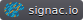

.. _acknowledge:

==================
How to cite signac
==================

.. sidebar:: |badge|

      Consider placing this badge on **presentation slides** or **README** files!
      See :ref:`badge` for instructions.

Preferred Citation
==================

Please acknowledge the use of this software within the body of your publication by copying or adapting the following:

*The computational workflow and data management for this publication was supported by the signac data management framework [ADRG18].*

.. bibliography::
    :filter: False

    signac_commat

A preprint of this paper is also available as `arXiv:1611.03543 <https://arxiv.org/abs/1611.03543>`__.

--------

If you make use of **signac-flow**, we also strongly recommend citing the following publication:

.. bibliography::
    :filter: False

    signac_scipy_2018

--------

If your paper makes use of the **signac-flow** features for aggregation, groups, and bundling or **signac** features for synced collections, consider citing:

.. bibliography::
    :filter: False

    signac_scipy_2021

--------

If possible, we also recommend including a citation of the associated Zenodo resource:

.. bibliography::
    :filter: False

    signac_zenodo

--------

To cite these references, you can use the following BibTeX entries:

.. literalinclude:: acknowledge.bib
    :language: bibtex

.. _badge:

Badge
=====

You can add the following badge to **presentation slides** or **README** files to acknowledge the use of **signac** as part of your project: |badge|

.. rubric:: Downloads

* :download:`PDF (high resolution) <badge/signac.io-dark.pdf>`
* :download:`PNG (high resolution) <badge/signac.io-dark.png>`
* :download:`SVG (low resolution) <badge/signac.io-dark.svg>`

.. rubric:: URL

.. code-block:: html

    https://docs.signac.io/en/latest/_images/signac.io-dark.svg

.. rubric:: Markdown

.. code-block:: html

    

.. rubric:: reStructuredText

.. code-block:: rst

    .. image:: https://docs.signac.io/en/latest/_images/signac.io-dark.svg
        :target: https://signac.io

Badges generated with `shields.io <https://shields.io>`_.

Logos
=====

The **signac** logos & badges are licensed under the `Creative Commons Attribution 4.0 International (CC BY 4.0) license`_.
This means you can use logos as long as you attribute the logos to the **signac** project.

.. _`Creative Commons Attribution 4.0 International (CC BY 4.0) license`: https://creativecommons.org/licenses/by/4.0/
