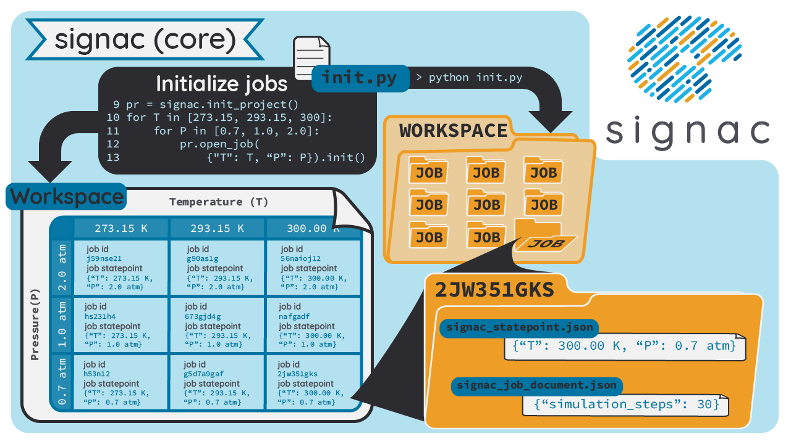

.. _introduction:
.. _overview:

=======
Concept
=======

The **signac** framework is designed to simplify the storage, generation and analysis of multidimensional data sets associated with large-scale, file-based computational studies.
Any computational work that requires you to manage files and execute workflows may benefit from an integration with **signac**.
Typical examples include hyperparameter optimization for machine learning applications and high-throughput screening of material properties with various simulation methods.
The data model assumes that the work can be divided into so called *projects*, where each project is roughly confined by similarly structured data, e.g., a parameter study.

In **signac**, the elements of a project's data space are called *jobs*.
Every job is defined by a unique set of well-defined parameters that define the job's context, and it also contains all the data associated with this metadata.
This means that all data is uniquely addressable from the associated parameters.
With **signac**, we define the processes generating and manipulating a specific data set as a sequence of operations on a job.
Using this abstraction, **signac** can define workflows on an arbitrary **signac** data space.

.. _concepts_overview

    Overview of the **signac** framework.
    When a project is initialized (such as `signac init` on the command line) a `workspace/` directory is created.
    Each job is uniquely identified by a set of user-defined state points, which are formatted as dictionaries.
    The workspace holds a directory for each job, containing JSON files that store the state point and job document.
    The job directory name is a hash of the state point's contents.
    Here, the ``init.py`` file initializes an empty project and adds one job with state point ``{"a": 1}``.
    Next, users define a workflow using a subclass of **signac-flow**'s ``FlowProject``.
    The workflow shown has three operations (simulate, analyze, visualize) that, when executed, produce two new files ``results.txt`` and ``plot.png`` in the job directory.
