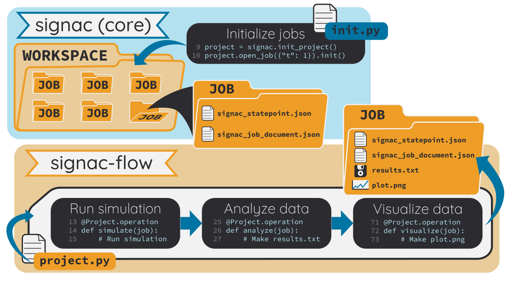

.. _introduction:
.. _overview:

=======
Concept
=======

The **signac** framework is designed to simplify the generation, storage, and analysis of multidimensional data sets associated with large-scale, file-based computational studies.
The framework consists of three Python packages: **signac** (core) maintains a file-based database; **signac-flow** allows users to specify workflows and submit operations to scheduling systems; **signac-dashboard** runs a local webserver to browse a **signac** project.

Generally speaking, in **signac**, collections of parameter values are *jobs* and are stored in a flat directory structure.
Every job contains both the metadata (constant parameters like temperature, volume) and data (measurements), and the metadata are hashed to create the job's directory name.
This means that all data is uniquely addressable from the associated metadata.
Consequently, any computational work that requires you to manage files and execute workflows may benefit from an integration with **signac**.
Typical examples include hyperparameter optimization for machine learning applications and high-throughput screening of material properties with various simulation methods.

More specifically, the data model of **signac** assumes that the smallest unit to track is the :term:`parameter`, which can take on different values, whether used as input for computer simulations or variables in an experiment.
A set of parameters along with their values is a :term:`state point`.
This may specify the information needed to run code like a simulation, do a lab experiment, or specify model hyperparameters.
The md5 hash of a state point uniquely defines a job, and all job data is stored in the corresponding :term:`job directory`.
The machinery of **signac** is designed to handle jobs in a flexible way.

With **signac-flow**, we define the process of generating and manipulating a specific data set as a sequence of operations on a job.
Using this abstraction, **signac** can define workflows on an arbitrary **signac** project.

.. _signac_and_flow:

    Overview of the **signac** framework.
    When a **signac** project is initialized, a ``workspace/`` directory is created.
    Each job is uniquely identified by its `state point`, a unique dictionary that contains relevant parameters describing the job.
    The :term:`workspace` holds a directory for each job, containing JSON files that store the state point and job document.
    The job directory name is a hash of the state point's contents.
    Here, the ``init.py`` file initializes an empty project and adds one job with state point ``{"t": 1}``.
    Next, users define a workflow using a subclass of **signac-flow**'s ``FlowProject``.
    The workflow shown has three operations (simulate, analyze, visualize) that, when executed, produce two new files ``results.txt`` and ``plot.png`` in the job directory.
